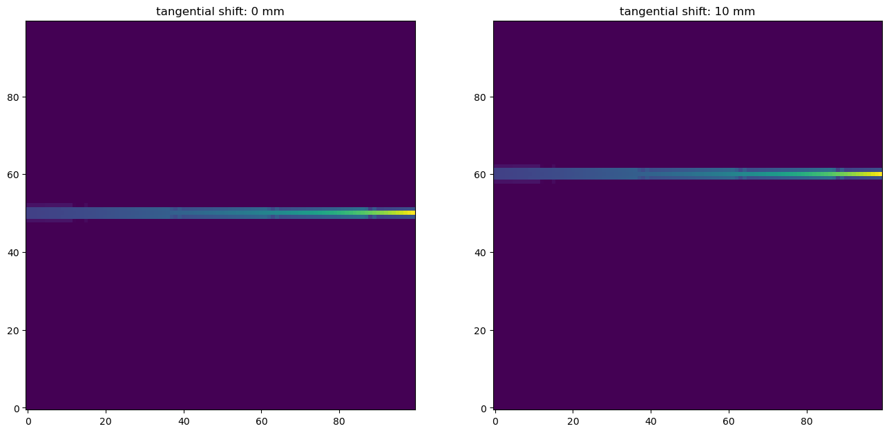

.. _read_sysmat_example:

Example of reading a system matrix from a HDF5 file
===================================================

.. code:: ipython3

    import numpy as np
    import h5py
    import matplotlib.pyplot as plt

.. code:: ipython3

    f = h5py.File('test_small.hdf5', 'r')
    sysmat = np.asarray(f['systmat'])
    print(sysmat.shape)
    fig, axs = plt.subplots(1,2,figsize=(16,9))
    id_det, id_rot, id_r, id_t = (0, 0, 0, 0)
    data=sysmat[id_t,id_r,id_rot,id_det]
    # data1=sysmat[id_t,id_r,5,id_det]
    datasum = np.sum(sysmat[id_t,id_r,:,id_det],axis=0)
    
    titles=[
        'rotation angle: 0 degrees',
        'sum of all angles: 0 to 360 degrees, seperated by 10 degrees',
    ]
    for id in range(0,2):
        axs[id].set_title(titles[id])
        
    axs[0].imshow(data.reshape(100,100), origin='lower')
    # axs[1].imshow(data1.reshape(100,100), origin='lower')
    axs[1].imshow(datasum.reshape(100,100), origin='lower')
    plt.show()

.. parsed-literal::

    (1, 1, 36, 1, 10000)

.. image:: img/read_sysmat_1_1.png

.. code:: ipython3

    f.close()
    f = h5py.File('test_small_rshift.hdf5', 'r')
    sysmat = np.asarray(f['systmat'])
    print(sysmat.shape)
    fig, axs = plt.subplots(1,2,figsize=(16,9))
    id_det, id_rot, id_r, id_t = (0, 0, 0, 0)
    data=sysmat[id_t,id_r,id_rot,id_det]
    data1=sysmat[id_t,1,id_rot,id_det]
    # datasum = np.sum(sysmat[id_t,:,0,id_det],axis=0)
    axs[0].imshow(data.reshape(100,100), origin='lower')
    axs[1].imshow(data1.reshape(100,100), origin='lower')
    titles=[
        'radial shift: 75 mm',
        'radial shift: 150 mm',
    ]
    for id in range(0,2):
        axs[id].set_title(titles[id])
    # axs[1].imshow(datasum.reshape(100,100), origin='lower')
    plt.show()

.. parsed-literal::

    (1, 2, 2, 1, 10000)

.. image:: img/read_sysmat_2_1.png

.. code:: ipython3

    f.close()
    f = h5py.File('test_small_tshift.hdf5', 'r')
    sysmat = np.asarray(f['systmat'])
    print(sysmat.shape)
    fig, axs = plt.subplots(1,2,figsize=(16,9))
    id_det, id_rot, id_r, id_t = (0, 0, 0, 0)
    data=sysmat[id_t,id_r,id_rot,id_det]
    data1=sysmat[1,id_r,id_rot,id_det]
    # datasum = np.sum(sysmat[id_t,:,0,id_det],axis=0)
    axs[0].imshow(data.reshape(100,100), origin='lower')
    axs[1].imshow(data1.reshape(100,100), origin='lower')
    titles=[
        'tangential shift: 0 mm',
        'tangential shift: 10 mm',
    ]
    for id in range(0,2):
        axs[id].set_title(titles[id])
    # axs[1].imshow(datasum.reshape(100,100), origin='lower')
    plt.show()

.. parsed-literal::

    (2, 1, 2, 1, 10000)

