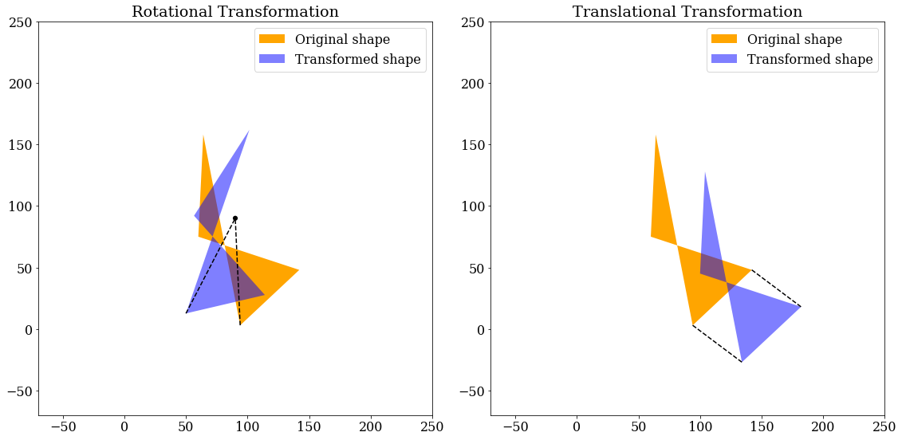
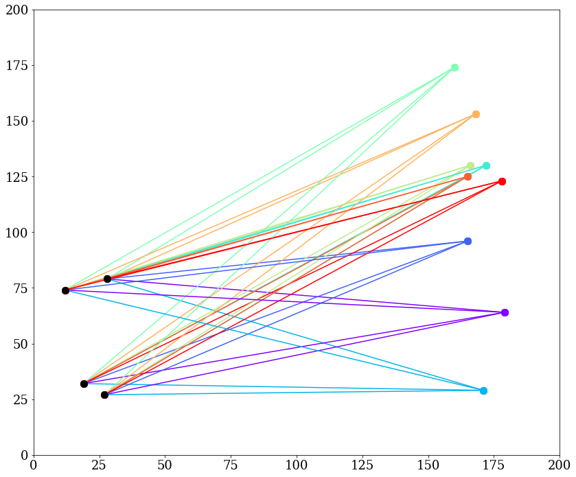

This file is generated with 
```shell
cat *.md > README.md
```
in fedora linux and then manully edited.
# Validation of the coordinate transformation function defined in the `pymatcal` module. As in `coord_transform.py`

## import the modules


```python
import sys
sys.path.insert(0, '..')
import pymatcal
import numpy as np
import matplotlib.pyplot as plt
import matplotlib as mpl

```

## Generate random coordinates


```python
angle_rad = np.pi/6.0
input_np = np.array([[5, 5, 0]])

# randomly generated points
rng = np.random.default_rng()
npx = 4
ydata = rng.integers(low=0, high=180, size=npx)
xdata = rng.integers(low=0, high=180, size=npx)

```

### Shape the coordinates to the desired data shape


```python
data1 = np.vstack([xdata, ydata, np.zeros(npx)]).T

```

## Perform the transformations

### Rotational transformation around x,y = (90,90)


```python
mr, mt = pymatcal.get_mtransform(angle_rad, 90, 90)
data2 = pymatcal.coord_transform(
    mr, mt, data1-np.array((90, 90, 0)))

```

### Pure translational transformation by dx,dy = (40,-30)


```python
mr, mt = pymatcal.get_mtransform(0, 40, -30)
data3 = pymatcal.coord_transform(
    mr, mt, data1)
```

## Plot the result


```python
plt.rcParams["font.family"] = "serif"
mpl.rcParams.update({'font.size': 16})
fig, axs = plt.subplots(1,2,figsize=(16, 10))
for ax in axs:
    ax.set_xlim(-70, 250)
    ax.set_ylim(-70, 250)
    ax.set_aspect('equal')
axs[0].add_patch(mpl.patches.Polygon(data1[:, 0:2], fc='orange',label='Original shape'))
axs[0].add_patch(mpl.patches.Polygon(data2[:, 0:2], alpha=0.5, fc='blue',label='Transformed shape'))
axs[0].plot([data1[0, 0], 90],
        [data1[0, 1], 90], c='k',ls='--')
axs[0].plot([data2[0, 0], 90],
        [data2[0, 1], 90], c='k',ls='--')
axs[0].add_patch(mpl.patches.Circle((90, 90), 2, fc='k'))
axs[0].legend()
axs[0].set_title("Rotational Transformation")

axs[1].add_patch(mpl.patches.Polygon(data1[:, 0:2], fc='orange',label='Original shape'))
axs[1].add_patch(mpl.patches.Polygon(data3[:, 0:2], alpha=0.5, fc='blue',label='Transformed shape'))
for idx in [0,3]:
        axs[1].plot([data1[idx, 0], data3[idx,0]],
                [data1[idx, 1], data3[idx, 1]], c='k',ls='--')
# axs[1].add_patch(mpl.patches.Circle((90, 90), 2, fc='k'))
axs[1].legend()
axs[1].set_title("Translational Transformation")
fig.tight_layout()
fig.savefig("coordinate-tranformation-module.png")
# plt.show()

```


    

    


### Length is kept the same after the tranformation:


```python
print(np.linalg.norm(data1[0]-data1[2]),np.linalg.norm(data2[0]-data2[2]))

```

    128.01562404644207 128.01562404644207
    128.01562404644207 128.01562404644207


### All the data points are shifted exactly the way we want


```python
for dxy in data1-data3:  
    print(dxy)
```

    [-40.  30.   0.]
    [-40.  30.   0.]
    [-40.  30.   0.]
    [-40.  30.   0.]


```python

```

# Validation of the `intersections` submodule defined in the `pymatcal` module. As in `intersections.py`
```python
import sys
sys.path.insert(0, '..')
import pymatcal
import numpy as np
import matplotlib.pyplot as plt
import matplotlib as mpl
```

# Calculate AB pairs. There should be $N_{A} N_{B}$ pairs

## Generate random sets of points A and points B


```python
rng = np.random.default_rng()
na=4
nb=9
pAs= rng.integers(low=(10,10), high=(30,180), size=(na,2))
pBs= rng.integers(low=(160,10), high=(180,180), size=(nb,2))
```

## Calculate pair AB using the function defined in the module `pymatcal`


```python
abpairs=pymatcal.get_AB_pairs(pAs,pBs)

```

The plot should show a line for every pair of AB, totaly 36 lines conneting points A and points B


```python
plt.rcParams["font.family"] = "serif"
plt.rcParams["font.size"] = 18
fig, ax = plt.subplots(figsize=(12, 10))
color = plt.cm.rainbow(np.linspace(0, 1, nb))
idx = 0
for pair in abpairs:
    ax.plot(pair[0::2], pair[1::2], 'o-',c=color[idx % 9],ms=10)
    idx += 1
# axs[1].scatter(pAs[:, 0], pAs[:, 1], s=100, c="k")
ax.plot(pAs[:, 0], pAs[:, 1], 'o',ms=10, c="k")
# ax.set_aspect('equal')
ax.set_xlim(0,200)
ax.set_ylim(0,200)
fig.tight_layout()
```


    

    

