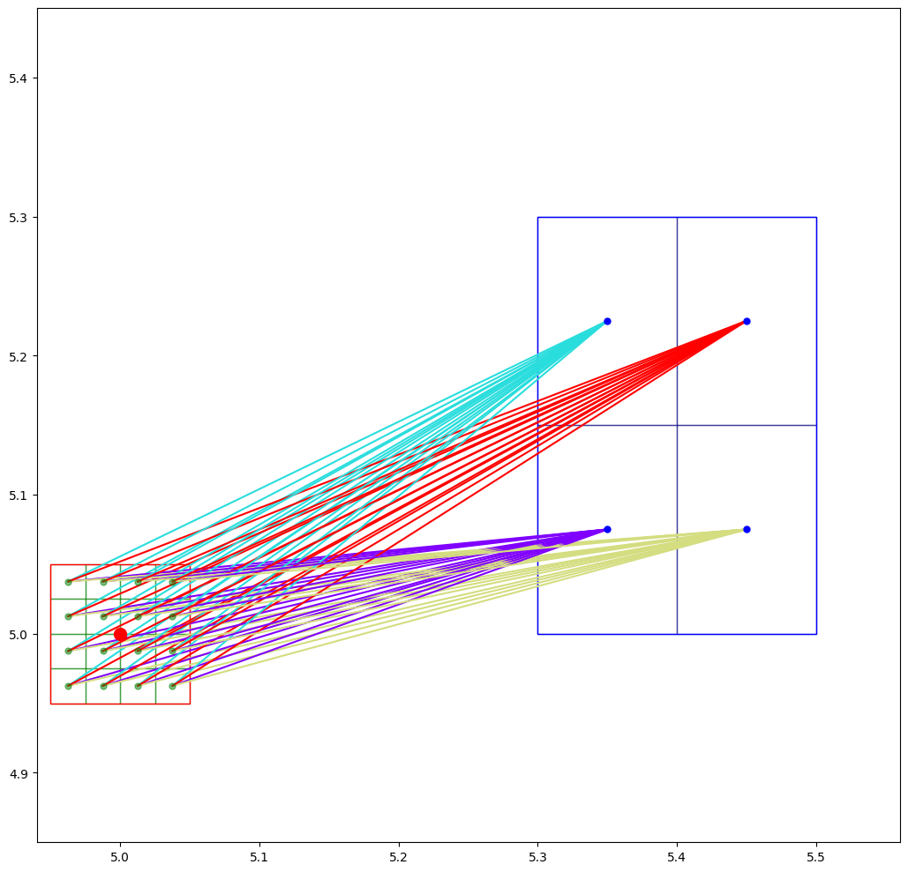
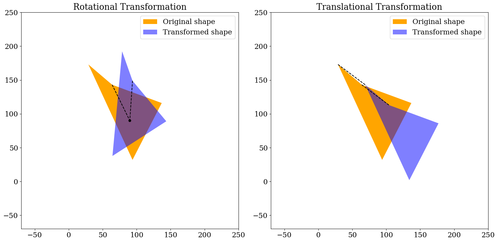
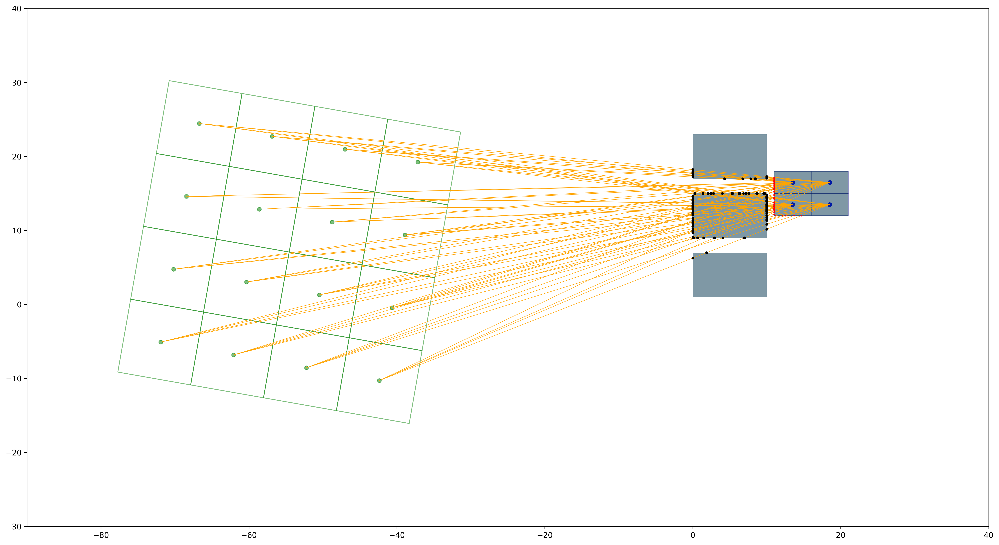
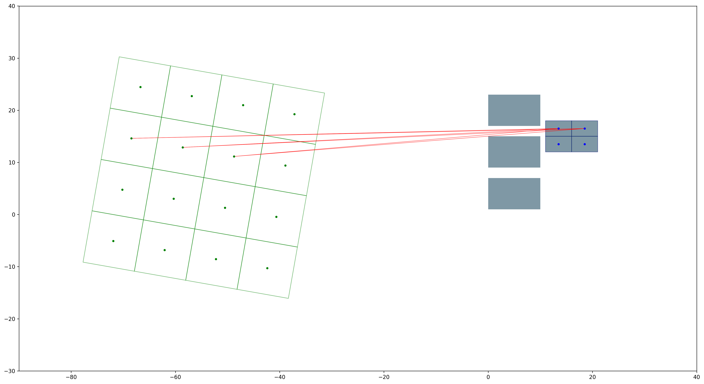

This file is generated with
```shell
python generate-README.md
```
# Validate the `get_config()` function

## Import packages


```python
import sys
sys.path.insert(0, '..')
import pymatcal
import matplotlib as mpl
import matplotlib.pyplot as plt
import numpy as np
```

## Read in the configuration from `YAML` file
- The `get_config()` function validates the configuration against a predefined schema. 
- The schema follows [JSON Schema](https://json-schema.org/specification). The current version of predefined schema is stored in `pymatcal/config_schema.json`.
- The `get_config()` function also parses the read-in configuration to correct data type.
- The return of the function is a dictionary


```python
config = pymatcal.get_config('../configs/config.yml')
```

## Plot the detector and the FOV


```python
detGeoms = config["det geoms"]
detDim = np.array(
    [
        (np.max(detGeoms[:, idx * 2 + 1]) - np.min(detGeoms[:, idx * 2]))
        for idx in range(0, 3)
    ]
)
# print(np.max(detGeoms[:, 3]), np.min(detGeoms[:, 2]))
detectors = detGeoms[detGeoms[:, 6] != 0]
plates = detGeoms[detGeoms[:, 6] == 0]
imgDims = config["img nvx"] * config["mmpvx"]
angle = config["angle"]
radial_shift = config["dist"]
tangential_shift = detDim[1] * 0.5


def get_patchList(detectors, radial_shift, tangential_shift):
    det_xy = np.array(
        [detectors[:, 0] + radial_shift, detectors[:, 2] - tangential_shift]
    ).T
    det_inc_xy = np.array(
        [(detectors[:, 1] - detectors[:, 0]), (detectors[:, 3] - detectors[:, 2])]
    ).T
    return [
        mpl.patches.Rectangle(
            xy, inc_xy[0], inc_xy[1], angle=angle, rotation_point=(0, 0)
        )
        for xy, inc_xy in zip(det_xy, det_inc_xy)
    ]


pc1 = mpl.collections.PatchCollection(
    get_patchList(detectors, radial_shift, tangential_shift),
    ec="k",
    fc=(0.9, 0.9, 0.7, 1),
)
pc2 = mpl.collections.PatchCollection(
    get_patchList(plates, radial_shift, tangential_shift), ec="none", fc=(0.3, 0.3, 0.5, 1)
)
fig, ax = plt.subplots(figsize=(12, 10), dpi=150)
ax.add_patch(
    mpl.patches.Rectangle(
        (-imgDims[0] * 0.5, -imgDims[1] * 0.5),
        imgDims[0],
        imgDims[1],
        fc="none",
        ec=(1, 0, 0, 0.5),
    )
)
ax.add_patch(
    mpl.patches.Rectangle(
        (
            np.min(detGeoms[:, 0]) + radial_shift,
            np.min(detGeoms[:, 2]) - tangential_shift,
        ),
        detDim[0],
        detDim[1],
        fc=(0, 0, 0.5, 0.2),
        ec='none',
        angle=angle,
        rotation_point=(0, 0),
    )
)
ax.add_patch(
    mpl.patches.Circle((0, 0), radial_shift, fc="none", ec=(0, 0.8, 0, 0.1), ls="--")
)
ax.add_patch(mpl.patches.Circle((0, 0), 0.25, fc="r", ec="none", ls="--"))
ax.add_collection(pc1)
ax.add_collection(pc2)
figDimx = (detDim[0] + radial_shift) * 2
ax.set_xlim(-figDimx * 0.52, figDimx * 0.52)
ax.set_ylim(-figDimx * 0.52, figDimx * 0.52)
ax.set_aspect("equal")

fig.tight_layout()
```


    

    


```python

```
Generate Markdown file with shell command:
```Shell
jupyter nbconvert --to markdown get_subdivcoords.ipynb
```

# Validate the `get_subdivcoords()` function

## Import packages


```python
import sys
sys.path.insert(0, '..')
import pymatcal
import matplotlib as mpl
import matplotlib.pyplot as plt
import numpy as np
```

## Read in the configuration from `YAML` file


```python
config = pymatcal.get_config('../configs/config.yml')
```

## Plot the FOV subdiv centroids and a detector cuboid not too far away


```python

pointA = np.array([5, 5, 0])
cuboid = np.array([5, 5.2, 5, 5.3, -0, 5, 0, 5, 1, 0.48])

radial_shift = 0.3
det_subs = pymatcal.get_det_subdivcoords(cuboid, config['det nsub'])
subdiv_inc = np.array([config['mmpvx'][0]/config['img nsub']
                      [0], config['mmpvx'][1]/config['img nsub'][1]])
subcentroids = pymatcal.get_img_subdivcoords(config)+pointA
pAs = subcentroids
pBs = det_subs['coords']+np.array([radial_shift, 0, 0])

det_subdiv_list = [mpl.patches.Rectangle(
    xy[:2]-det_subs['incs'][:2]*0.5, det_subs['incs'][0], det_subs['incs'][1]) for xy in pBs]

img_subdiv_list = [mpl.patches.Rectangle(
    xy-subdiv_inc*0.5, subdiv_inc[0], subdiv_inc[1]) for xy in subcentroids[:, :2]]
abpairs=pymatcal.get_AB_pairs(pAs,pBs)
idx=0
# nb=pBs.shape[0]
# na=pAs.shape[0]
# print(nb,na)
# print(abpairs[0])
```

    [4. 4. 1.]
    [0.1 0.1 1. ]


```python
fig, ax = plt.subplots(figsize=(12, 10))
pc = mpl.collections.PatchCollection(
    img_subdiv_list, ec=(0, 0.5, 0, 0.5), fc='none')
pc1 = mpl.collections.PatchCollection(
    det_subdiv_list, ec=(0, 0, 0.5, 0.5), fc='none')
color = plt.cm.rainbow(np.linspace(0, 1, nb))
for pair in abpairs:
    ax.plot(pair[0::3], pair[1::3], ',-',c=color[idx % nb],ms=10)
    idx += 1
# print(subcentroids)
ax.plot(subcentroids[:, 0], subcentroids[:, 1],
        '.', color=(0, 0.5, 0, 0.5), ms=10)
ax.plot(det_subs['coords'][:, 0]+radial_shift, det_subs['coords'][:, 1],
        '.', color=(0, 0, 1, 1), ms=10)
ax.plot(pointA[0], pointA[1], 'r.', ms=20)
ax.set_xlim(pointA[0]-config['mmpvx'][0]*0.6, pointA[0] +
            config['mmpvx'][0]*.6+radial_shift+cuboid[1]-cuboid[0])
ax.set_ylim(np.min(np.asarray([pointA[1]-config['mmpvx'][1]*0.6, cuboid[2]-0.5*(cuboid[3]-cuboid[2])])),
            np.max(np.asarray([pointA[1]+config['mmpvx'][1]*.6, cuboid[3]+0.5*(cuboid[3]-cuboid[2])])))
ax.add_collection(pc)
ax.add_collection(pc1)
ax.add_patch(mpl.patches.Rectangle(
    (pointA-config['mmpvx']*0.5)[:2], config['mmpvx'][0], config['mmpvx'][1], fc='none', ec='r'))

ax.add_patch(mpl.patches.Rectangle(
    (cuboid[0]+radial_shift, cuboid[2]), cuboid[1]-cuboid[0], cuboid[3]-cuboid[2], fc='none', ec='b'))
ax.set_aspect('equal')
fig.tight_layout()
# fig.savefig("get_subdivcoords.png",dpi=300)
```


    

    


```python

```
# Validation of the coordinate transformation function defined in the `pymatcal` module

## import the modules


```python
import sys
sys.path.insert(0, '..')
import pymatcal
import numpy as np
import matplotlib.pyplot as plt
import matplotlib as mpl

```

## Generate random coordinates


```python
angle_deg= 30
input_np = np.array([[5, 5, 0]])

# randomly generated points
rng = np.random.default_rng()
npx = 4
ydata = rng.integers(low=0, high=180, size=npx)
xdata = rng.integers(low=0, high=180, size=npx)

```

### Shape the coordinates to the desired data shape


```python
data1 = np.vstack([xdata, ydata, np.zeros(npx)]).T

```

## Perform the transformations

### Rotational transformation around x,y = (90,90)


```python
mr, mt = pymatcal.get_mtransform(angle_deg, 90, 90)
data2 = pymatcal.coord_transform(
    (mr, mt), data1-np.array((90, 90, 0)))

```

    0.5235987755982988


### Pure translational transformation by dx,dy = (40,-30)


```python
mr, mt = pymatcal.get_mtransform(0, 40, -30)
data3 = pymatcal.coord_transform(
    (mr, mt), data1)
```

    0.0


## Plot the result


```python
plt.rcParams["font.family"] = "serif"
mpl.rcParams.update({'font.size': 16})
fig, axs = plt.subplots(1,2,figsize=(16, 10))
for ax in axs:
    ax.set_xlim(-70, 250)
    ax.set_ylim(-70, 250)
    ax.set_aspect('equal')
axs[0].add_patch(mpl.patches.Polygon(data1[:, 0:2], fc='orange',label='Original shape'))
axs[0].add_patch(mpl.patches.Polygon(data2[:, 0:2], alpha=0.5, fc='blue',label='Transformed shape'))
axs[0].plot([data1[0, 0], 90],
        [data1[0, 1], 90], c='k',ls='--')
axs[0].plot([data2[0, 0], 90],
        [data2[0, 1], 90], c='k',ls='--')
axs[0].add_patch(mpl.patches.Circle((90, 90), 2, fc='k'))
axs[0].legend()
axs[0].set_title("Rotational Transformation")

axs[1].add_patch(mpl.patches.Polygon(data1[:, 0:2], fc='orange',label='Original shape'))
axs[1].add_patch(mpl.patches.Polygon(data3[:, 0:2], alpha=0.5, fc='blue',label='Transformed shape'))
for idx in [0,3]:
        axs[1].plot([data1[idx, 0], data3[idx,0]],
                [data1[idx, 1], data3[idx, 1]], c='k',ls='--')
# axs[1].add_patch(mpl.patches.Circle((90, 90), 2, fc='k'))
axs[1].legend()
axs[1].set_title("Translational Transformation")
fig.tight_layout()
# fig.savefig("coordinate-tranformation-module.png")
# plt.show()

```


    

    


### Length is kept the same after the tranformation:


```python
print(np.linalg.norm(data1[0]-data1[2]),np.linalg.norm(data2[0]-data2[2]))

```

    128.01562404644207 128.01562404644207
    128.01562404644207 128.01562404644207


### All the data points are shifted exactly the way we want


```python
for dxy in data1-data3:  
    print(dxy)
```

    [-40.  30.   0.]
    [-40.  30.   0.]
    [-40.  30.   0.]
    [-40.  30.   0.]


```python

```
# Validation of the 2D ray-rectangle intersection calculation

## imports


```python
import sys
sys.path.insert(0, '..')
import pymatcal
import matplotlib as mpl
import matplotlib.pyplot as plt
import numpy as np
```

## Read in the configuration, should be tested by `get_config.ipynb`


```python
config = pymatcal.get_config('test-config.yml')
print(config['dist'])
```

    60.0


## Define point $A$ in FOV for debugging


```python
pointA = np.array([5, 3, 0])
angle_deg = 10
```

## Setup subdivisions and $p_A p_B$ pairs


```python
det_subdivs = pymatcal.get_det_subdivs(
    config['active det'][0], config['det nsub'])
img_subdivs = pymatcal.get_img_subdivs(config['mmpvx'], config['img nsub'])

pAs = img_subdivs['coords']+pointA
# pBs = det_subdivs['coords']+np.array([config['dist'], 0, 0])
pBs = det_subdivs['coords']

pAs = pymatcal.coord_transform(
    pymatcal.get_mtransform(angle_deg, -config['dist'], 5), pAs)
abpairs = pymatcal.get_AB_pairs(pAs, pBs)
```

## Set blocking detector units array and the focused detector unit


```python
blocks = config["det geoms"][config["det geoms"][:,6] != config["active det"][0][6]]
focus_det = np.array([config["active det"][0]])
print(blocks.shape,focus_det.shape)
```

    (3, 8) (1, 8)


## Test calculation of intersects. Note: the intersects coordinates are only for debugging and plotting purpose

### 1. Calculate the corresponding intersections on blocking detector units and on the focused detector unit 


```python

intersects_blk = pymatcal.get_intersects_2d(blocks,abpairs)
intersects_det = pymatcal.get_intersects_2d(focus_det,abpairs)
```

### 2. Plot intersects and rays


```python
det_subdiv_list = [
    mpl.patches.Rectangle(
        xy[:2] - det_subdivs["incs"][:2] * 0.5,
        det_subdivs["incs"][0],
        det_subdivs["incs"][1],
    )
    for xy in pBs
]
subdiv_inc = np.array(
    [
        config["mmpvx"][0] / config["img nsub"][0],
        config["mmpvx"][1] / config["img nsub"][1],
    ]
)
img_subdiv_list = [
    mpl.patches.Rectangle(
        xy - subdiv_inc * 0.5,
        subdiv_inc[0],
        subdiv_inc[1],
        angle=-angle_deg,
        rotation_point=(xy[0],xy[1])
    )
    for xy in pAs[:, :2]
]

fig, ax = plt.subplots(figsize=(20, 10), dpi=300)
pc = mpl.collections.PatchCollection(img_subdiv_list, ec=(0, 0.5, 0, 0.5), fc="none")
pc1 = mpl.collections.PatchCollection(det_subdiv_list, ec=(0, 0, 0.5, 0.5), fc="none")
idx = 0
# passIndx = np.all(np.all(ts == 0, axis=2),axis=0)

# for pair in abpairs[passIndx]:
for pair in abpairs:
    ax.plot(pair[0::3], pair[1::3], ",-", c="orange", ms=10, lw=0.5,zorder=12)
    idx += 1

block_list = [
    mpl.patches.Rectangle((geom[0], geom[2]), geom[1] - geom[0], geom[3] - geom[2])
    for geom in config["det geoms"]
]
pc2 = mpl.collections.PatchCollection(
    block_list, fc=(0, 0.2, 0.3, 0.5), ec="none", zorder=10
)
ax.add_collection(pc2)
ax.plot(pAs[:, 0], pAs[:, 1], ".", color=(0, 0.5, 0, 0.5), ms=10)
ax.plot(pBs[:, 0], pBs[:, 1], ".", color=(0, 0, 1, 1), ms=10)
pAs_mins = np.min(pAs, axis=0)
pAs_maxs = np.max(pAs, axis=0)
det_mins = np.min(config["det geoms"], axis=0)
det_maxs = np.max(config["det geoms"], axis=0)
ax.set_xlim(-90, 40)
ax.set_ylim(-30, 40)

ax.add_collection(pc)
ax.add_collection(pc1)

ax.set_aspect("equal")
for idx in [0, 1]:
    ax.plot(intersects_blk[:, 0, idx], intersects_blk[:, 1, idx], "k.", ms=5,zorder=13)
ax.plot(intersects_det[:, 0, 0], intersects_det[:, 1, 0], "r.", ms=2, zorder=15)
fig.tight_layout()
# fig.savefig("intersection-2d_1.png", dpi=300)
```


    

    


### 3. Plot only rays passing through openings. Decision is based on $t$ numbers


```python
det_subdiv_list = [
    mpl.patches.Rectangle(
        xy[:2] - det_subdivs["incs"][:2] * 0.5,
        det_subdivs["incs"][0],
        det_subdivs["incs"][1],
    )
    for xy in pBs
]
subdiv_inc = np.array(
    [
        config["mmpvx"][0] / config["img nsub"][0],
        config["mmpvx"][1] / config["img nsub"][1],
    ]
)
img_subdiv_list = [
    mpl.patches.Rectangle(
        xy - subdiv_inc * 0.5,
        subdiv_inc[0],
        subdiv_inc[1],
        angle=-angle_deg,
        rotation_point=(xy[0], xy[1]),
    )
    for xy in pAs[:, :2]
]

fig, ax = plt.subplots(figsize=(20, 10), dpi=300)
pc = mpl.collections.PatchCollection(img_subdiv_list, ec=(0, 0.5, 0, 0.5), fc="none")
pc1 = mpl.collections.PatchCollection(det_subdiv_list, ec=(0, 0, 0.5, 0.5), fc="none")


idx = 0
ts = np.array([pymatcal.findt_2d(geom, abpairs) for geom in blocks])
passIndx = np.all(np.all(ts == 0, axis=2),axis=0)

for pair in abpairs[passIndx]:
    ax.plot(pair[0::3], pair[1::3], "-", c="r", ms=10, lw=0.5, zorder=12)
    idx += 1

block_list = [
    mpl.patches.Rectangle((geom[0], geom[2]), geom[1] - geom[0], geom[3] - geom[2])
    for geom in config["det geoms"]
]
pc2 = mpl.collections.PatchCollection(
    block_list, fc=(0, 0.2, 0.3, 0.5), ec="none", zorder=10
)
ax.add_collection(pc2)
ax.plot(pAs[:, 0], pAs[:, 1], ".", color=(0, 0.5, 0, 1), ms=6,zorder=15)
ax.plot(pBs[:, 0], pBs[:, 1], ".", color=(0, 0, 1, 1), ms=6,zorder=15)
pAs_mins = np.min(pAs, axis=0)
pAs_maxs = np.max(pAs, axis=0)
det_mins = np.min(config["det geoms"], axis=0)
det_maxs = np.max(config["det geoms"], axis=0)
ax.set_xlim(-90, 40)
ax.set_ylim(-30, 40)

ax.add_collection(pc)
ax.add_collection(pc1)
ax.set_aspect("equal")
fig.tight_layout()
# fig.savefig("intersection-2d_2.png", dpi=300)
```


    

    


## Get intersections


```python
intersections_blk = pymatcal.get_intersections_2d(blocks,abpairs)
intersections_det = pymatcal.get_intersections_2d(focus_det,abpairs)
```

### 3. Plot only rays passing through openings. Decision is based on whether intersection is zero.


```python
det_subdiv_list = [
    mpl.patches.Rectangle(
        xy[:2] - det_subdivs["incs"][:2] * 0.5,
        det_subdivs["incs"][0],
        det_subdivs["incs"][1],
    )
    for xy in pBs
]
subdiv_inc = np.array(
    [
        config["mmpvx"][0] / config["img nsub"][0],
        config["mmpvx"][1] / config["img nsub"][1],
    ]
)
img_subdiv_list = [
    mpl.patches.Rectangle(
        xy - subdiv_inc * 0.5,
        subdiv_inc[0],
        subdiv_inc[1],
        angle=-angle_deg,
        rotation_point=(xy[0], xy[1]),
    )
    for xy in pAs[:, :2]
]

fig, ax = plt.subplots(figsize=(20, 10), dpi=300)
pc = mpl.collections.PatchCollection(img_subdiv_list, ec=(0, 0.5, 0, 0.5), fc="none")
pc1 = mpl.collections.PatchCollection(det_subdiv_list, ec=(0, 0, 0.5, 0.5), fc="none")

passIndx = np.all(intersections_blk == 0, axis=0)
idx = 0
for pair in abpairs[passIndx]:
    ax.plot(pair[0::3], pair[1::3], "-", c="r", ms=10, lw=0.5, zorder=12)
    idx += 1

block_list = [
    mpl.patches.Rectangle((geom[0], geom[2]), geom[1] - geom[0], geom[3] - geom[2])
    for geom in config["det geoms"]
]
pc2 = mpl.collections.PatchCollection(
    block_list, fc=(0, 0.2, 0.3, 0.5), ec="none", zorder=10
)
ax.add_collection(pc2)
ax.plot(pAs[:, 0], pAs[:, 1], ".", color=(0, 0.5, 0, 1), ms=6, zorder=15)
ax.plot(pBs[:, 0], pBs[:, 1], ".", color=(0, 0, 1, 1), ms=6, zorder=15)
pAs_mins = np.min(pAs, axis=0)
pAs_maxs = np.max(pAs, axis=0)
det_mins = np.min(config["det geoms"], axis=0)
det_maxs = np.max(config["det geoms"], axis=0)
ax.set_xlim(-90, 40)
ax.set_ylim(-30, 40)

ax.add_collection(pc)
ax.add_collection(pc1)
ax.set_aspect("equal")
fig.tight_layout()
```


    

    


```python

```
```python
import sys
sys.path.insert(0, '..')
import pymatcal
import numpy as np
import matplotlib.pyplot as plt
import matplotlib as mpl
```

# Calculate AB pairs. There should be $N_{A} N_{B}$ pairs

## Generate random sets of points A and points B


```python
rng = np.random.default_rng()
na=4
nb=9
pAs= rng.integers(low=(10,10), high=(30,180), size=(na,2))
pBs= rng.integers(low=(160,10), high=(180,180), size=(nb,2))
```

## Calculate pair AB using the function defined in the module `pymatcal`


```python
abpairs=pymatcal.get_AB_pairs(pAs,pBs)

```

The plot should show a line for every pair of AB, totaly 36 lines conneting points A and points B


```python
plt.rcParams["font.family"] = "serif"
plt.rcParams["font.size"] = 18
fig, ax = plt.subplots(figsize=(12, 10))
color = plt.cm.rainbow(np.linspace(0, 1, nb))
idx = 0
for pair in abpairs:
    ax.plot(pair[0::2], pair[1::2], 'o-',c=color[idx % 9],ms=10)
    idx += 1
# axs[1].scatter(pAs[:, 0], pAs[:, 1], s=100, c="k")
ax.plot(pAs[:, 0], pAs[:, 1], 'o',ms=10, c="k")
# ax.set_aspect('equal')
ax.set_xlim(0,200)
ax.set_ylim(0,200)
fig.tight_layout()
```


    

    

